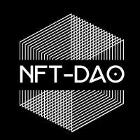

# Metadata-Standards-Liason
Liason with InterNFT and The Interwork Alliance 

## Contributors : 

## Discussions

### General Discussion ?
> go to https://github.com/NFT-DAO/Metadata-Standards-Liason/discussions and join in.
### Ideas ?
> go to https://github.com/NFT-DAO/Metadata-Standards-Liason/discussions/categories/ideas and join in.
### Questions and Answers (Q&A) ?
> go to https://github.com/NFT-DAO/Metadata-Standards-Liason/discussions/categories/q-a and join in.

## Meetings

Meeting Minutes will be recorded in Discussions (e.g. [Metadata Standards Liaison meeting - 13th April 2021](https://github.com/NFT-DAO/Metadata-Standards-Liason/discussions/3). To allow for threaded comments.

For documentation of meetings and/or links to meeting videos go to [Meetings](/Meetings). Each folder will have its own README to guide users further. Each sections description should be no more than a few sentences.

## Documents

For documentation of the metadata subject go to [Documents](/Documents/). Each folder will have its own README to guide users further. Each sections description should be no more than a few sentences.

## Proposals

For funding proposals go to [Proposals](Proposals/). Each folder will have its own README to guide users further. Each sections description should be no more than a few sentences.

## Licensing

See [LICENSE](LICENSE.txt) file. NFT-DAO Metadata is licensed by NFT-DAO LCC under the Apache license. 

